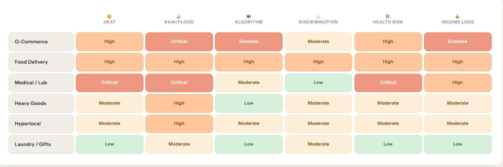
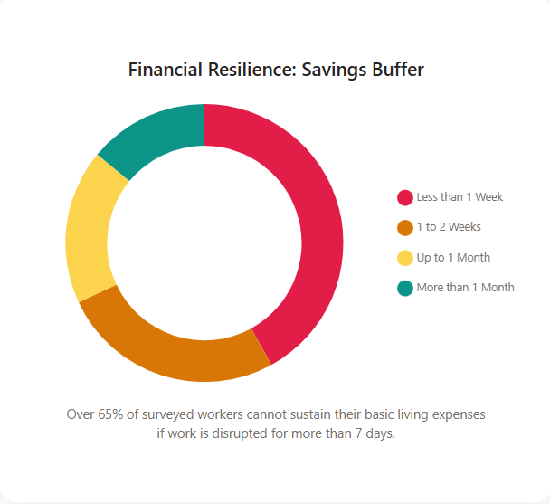

# Gig-work-insurance

## 🚀 Live Demonstrations & Downloads

### 🌐 1. GigWorker Web App (Driver Dashboard)
  
*Click the image above to watch the YouTube walk-through!*
*   **Live Web Prototype:** [Try out the Live Gig Worker Web App Demo Here!](https://your-public-vercel-link.vercel.app)

### 🛡️ 2. GigShield (Android Anti-Spoofing Defense)
*   **What is it?** Our Native Android App designed specifically to block the 24-hr Syndicate GPS-spoofing Crisis via OS-level hardware kernel checks.
*   **Watch the Native App Demo:** `[YouTube Link Coming Soon]`
*   **Download & Test on your phone:**  
  
*(Read the full [GigShield Firmware Defense Architecture](GigShield_Android_Defense/README.md) here)*

---## Risk Assessment

## Saving Buffer

# Persona: Food Delivery Partner (Zomato / Swiggy)

- Works 8–12 hours daily
- Earns ~₹20K–₹30K/month depending on demand
- Income depends on

    - Orders/hour    
    - Working hours
    - External conditions

Key reality:
> If they **cannot work → income = 0**

#  DISRUPTION TABLE 

## Environmental Disruptions (Primary Layer)

| Disruption Type | Example        | Measurable Parameter             | Impact (Income Loss)                       |
| --------------- | -------------- | -------------------------------- | ------------------------------------------ |
| Extreme Heat    | 42°C+ heatwave | Temperature, Heat Index          | Rider reduces working hours → ↓ deliveries |
| Heavy Rain      | Monsoon bursts | Rainfall (mm/hr)                 | Order cancellations + slower delivery      |
| Floods          | Urban flooding | Govt alerts / rainfall threshold | Zero deliveries in affected zone           |
| Pollution       | AQI > 300      | AQI API                          | Health discomfort → reduced shifts         |

👉 Insight:  
Gig workers **adapt in real-time (reduce hours)** → direct income drop

## Social Disruptions (Mobility Layer)

| Disruption Type | Example          | Measurable Parameter   | Impact                |
| --------------- | ---------------- | ---------------------- | --------------------- |
| Curfew          | Govt restriction | Zone lockdown flag     | 100% income loss      |
| Strikes         | Transport strike | Mobility index drop    | Partial/zero delivery |
| Zone Closure    | Political rally  | Geo-fenced restriction | No pickup/drop        |

## Platform Disruptions 

| Disruption Type | Example             | Measurable Parameter | Impact                  |
| --------------- | ------------------- | -------------------- | ----------------------- |
| Demand Crash    | Low orders          | Orders/hour ↓ 40%    | Lower earnings          |
| App Downtime    | Server crash        | API failure logs     | No orders               |
| Supply Chain    | Restaurant shutdown | Active restaurants ↓ | Earnings drop up to 50% |

## **WEEKLY PRICING MODELS (UPDATED)**
## 1️ Baseline + Event Guarantee — ₹50/week

- **Model:** Minimum weekly income (₹2500) if active hours met
- **Trigger:** Disruption → hours counted as worked
- **Outcome:** Income stability without forcing risky work
- **Pricing:** ₹50/week

## 2️ Micro-Insurance (5% Deduction Model) — ₹60/week

- **Model:** 5% of weekly earnings → Resilience Pool + platform match
- **Trigger:** Weather/event → automatic payout
- **Outcome:** Self-sustained parametric insurance fund
- **Pricing:** ₹60/week (base equivalent of 5% contribution)

## 3️ Hazard Multiplier Pay — ₹100/week

- **Model:** 1.5× base pay during Hazard Days
- **Trigger:** Rain / heat threshold crossed → automatic upgrade
- **Outcome:** Compensates risk instead of relying on surge pricing
- **Pricing:** ₹100/week
## 4️ Tiered Stability Contracts — ₹80/week

- **Model:** Fixed weekly schedule → guaranteed income floor
- **Trigger:** Curfew / lockdown → 70% payout
- **Outcome:** Predictable weekly earnings
- **Pricing:** ₹80/week
# AI / ML MODELS

- **Income Prediction:** XGBoost → predicts weekly earnings
    
- **Risk Prediction:** Random Forest → predicts disruption probability
    
- **Fraud Detection:** Isolation Forest → detects fake claims
    
- **Loss Estimation:** Regression → calculates income loss %
    

---

# PARAMETRIC TRIGGERS 

- Rainfall > threshold → payout
- Temperature > threshold → payout
- AQI > threshold → payout
- Curfew / zone closure → payout

# WEEKLY PRICING LOGIC

👉 AI dynamically adjusts pricing based on risk + income patterns (but within defined plan bands)

\text{Weekly Premium} = \text{Base Plan Price} + (\text{AI Risk Score} \times \text{Coverage Modifier})

### AI Inputs:

- Weather forecast (Open-Meteo)
- Location risk (Geoapify)
- Historical earnings pattern

---

### Dynamic Adjustment Example (within plans):

|Risk Level|Adjustment|Final Weekly Price|
|---|---|---|
|Low Risk|−₹10|₹40 – ₹90|
|Medium Risk|Base|₹50 – ₹100|
|High Risk|+₹20|₹70 – ₹120|

# TECH STACK SUMMARY

| Layer              | Current Prototype (Web)          | Future System (Mobile)      | Purpose                               |
| ------------------ | -------------------------------- | --------------------------- | ------------------------------------- |
| **Frontend**       | HTML, CSS, JavaScript            | Flutter                     | UI for dashboard, earnings, insurance |
| **Backend**        | FastAPI (Python)                 | FastAPI (Microservices)     | APIs, pricing logic, triggers         |
| **Database/API**   | sqllite                          | Supabase                    | Auth, DB, real-time data              |
| **AI/ML**          | Scikit-learn, XGBoost            | Real-time ML pipelines      | Risk & income prediction              |
| **External APIs**  | Open-Meteo, AQI, Geoapify (mock) | Open-Meteo, AQI, Geoapify   | Weather, AQI, location risk           |
| **Location**       | Mock (manual selection)          | Real-time GPS               | Event trigger & payouts               |
| **Notifications**  | —                                | Firebase Cloud Messaging    | Alerts & updates                      |
| **Infrastructure** | Local / basic cloud              | Docker, Kubernetes, AWS/GCP | Scaling & deployment                  |
